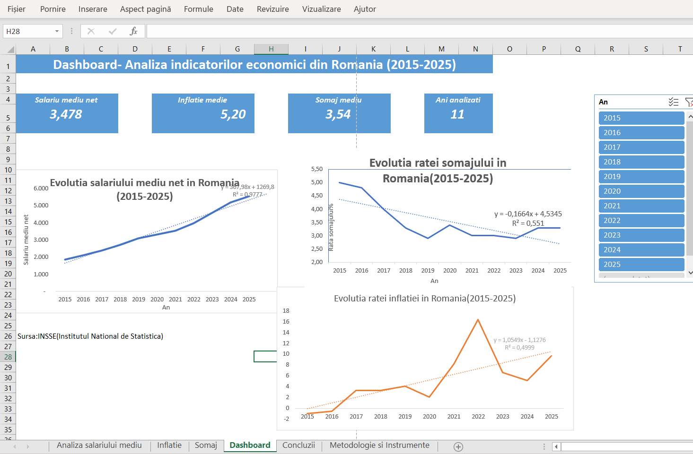
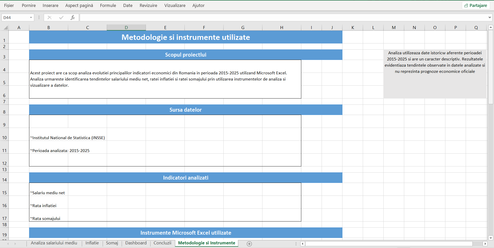
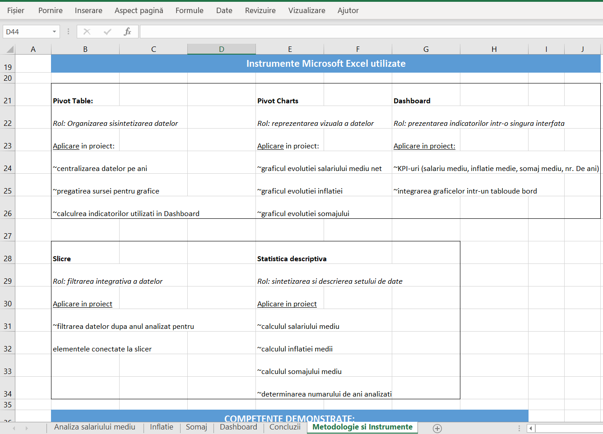

Designed and developed an interactive Microsoft Excel dashboard for analyzing Romania's economic indicators between 2015 and 2025 using official data from the National Institute of Statistics (INSSE).

The project combines data analysis, descriptive statistics, interactive dashboards and data visualization to identify economic trends over time.

Main features:
• Interactive Dashboard
• Pivot Tables
• Pivot Charts
• Slicers
• KPI Cards
• Descriptive Statistics
• Trend Analysis
• Conditional Formatting
• Data Visualization

Economic indicators analyzed:
• Net Average Salary
• Inflation Rate
• Unemployment Rate

The project also includes methodology, statistical conclusions and interactive filtering, making it suitable for business reporting and exploratory data analysis.

## Dashboard

## Average Net Salary Analysis

## Inflation Analysis

## Unemployment Analysis

## Conclusions

## Methodology

## Excel Tools Used

## Tools Used

### Methodology

### Excel Tools Used

